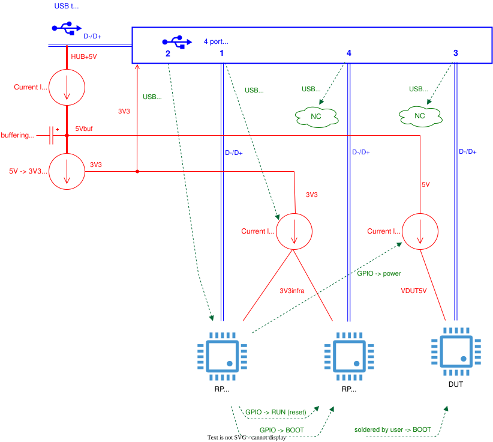

Tentacle v0.7 (recommended, 10 pieces produced)
=================================================================

This repo describes the hardware of a tentacle:

See also: :doc:`tentacle_v0.3`

Schematics
----------

:download:`Schematics v0.7 (Pdf) <../kicad/tentacle_v0.7/production_v0.7/schematics_tentacle_v0.7.pdf>`.

PCB
---
:doc:`Parts list <pcb/bom>`

The assembled PCB may be ordered at https://www.jclpcb.com. The production files are located here: `kicad/kicad_tentacle_v0.5/production_v0.5`.

The price of a assembled PCB is:

.. list-table::
    :header-rows: 1
    :align: right

    * - Pieces
      - USD total
      - USD per piece
    * - 5
      - 109
      - 21.8
    * - 10
      - 151
      - 15.1
    * - 15
      - 202
      - 13.5
    * - 20
      - 252
      - 12.6
    * - 25
      - 345
      - 13.8

The tentacle is described in more detail in :doc:`octoprobe:big_picture`

.. image:: tentacle_images/tentacle_intro_v0.6.drawio.png

USB and Power
-----------------

This block diagram shows the power distribution with MT9700 switches and how to enable boot mode for `RP_INFRA` and `RP_PROBE`.

