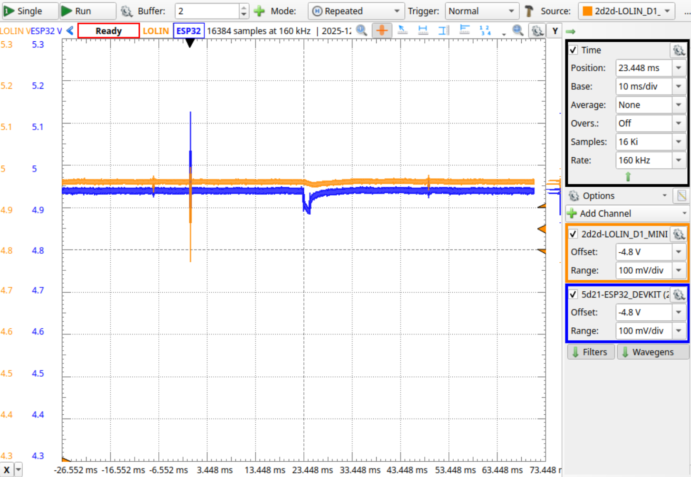
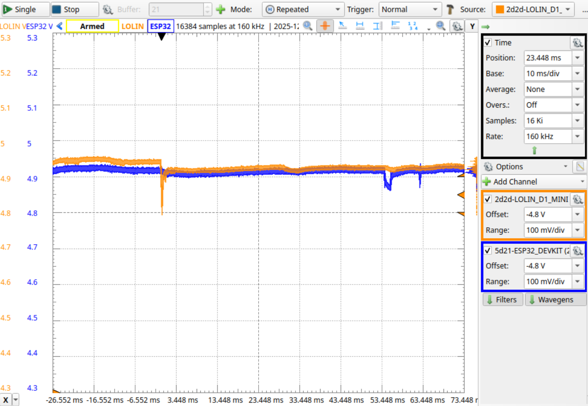
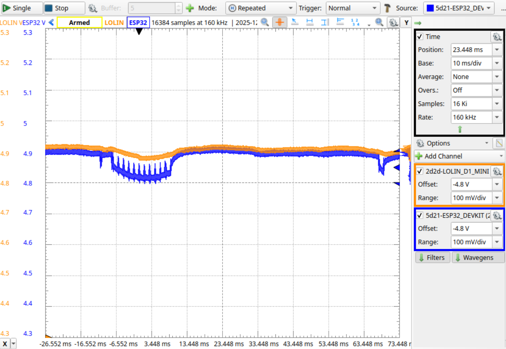

# Voltage Monitoring

Goal: There is some tests which fail randomlessly. Here we monitor the voltage - might be the boards fail to undervoltage...

Boards to observe
  See: https://reports.octoprobe.org/github_selfhosted_testrun_392/octoprobe_summary_report.html

  2d2d-LOLIN_D1_MINI
    Crash:
      https://reports.octoprobe.org/github_selfhosted_testrun_392/RUN-TESTS_STANDARD,a@2d2d-LOLIN_D1_MINI/testresults.txt

## Cabling

See: https://digilent.com/reference/test-and-measurement/analog-discovery-3/reference-manual

| AD3 | Tentacle Pads | Tentacle id |
| - | - | - |
| 1-/1+ | 0V/5V | 2d2d-LOLIN_D1_MINI |
| 2-/2+ | 0V/5V | 5d21-ESP32_DEVKIT |

===============================================

## Scope

Time, Position: 10ms
Time, Base: 10ms/div
Time, Samples: 16 Ki
Time, Rate: 160 kHz

Channel 1/2: Sample Mode: Min/Max
Channal 1, Name: 5d2a-ESP32
Channal 1, Label: ESP32
Channal 2, Name: 472b-ESP32_S3
Channal 2, Label: S3

Buffer, Buffers: 10k
Buffer, Run: Continous
Buffer, Run: Clear on Start
Buffer, Run: Run Reset
Buffer, Mode: Repeated

Trigger: Normal
Trigger, Source: Channel 1
Trigger, Type: Edge
Trigger, Condition: Falling
Trigger, Level: 4.5 V
Trigger, Hyst: 50 mV

## Setup

2 hubs Dlink H7, HW Version F1

Laboratory powersupply up to 3.5A. Set to 5.35V which results in ~5V at the plugs of the hub.

[Product](https://www.dlink.com/de/de/products/dub-h7-7-port-usb-2-0-hub),
[Datasheet](https://support.dlink.com/resource/PRODUCTS/DUB-H7/REVF/DUB-H7_F1_Datasheet_v1.00%28WW%29.pdf),
[Guide](https://support.dlink.com/resource/PRODUCTS/DUB-H7/REVF/DUB-H7_F1_QIG_v1.00.pdf)

Connected tentacles: 13

## Measurements

* https://reports.octoprobe.org/github_selfhosted_testrun_393/octoprobe_summary_report.html

  

* https://reports.octoprobe.org/github_selfhosted_testrun_394/octoprobe_summary_report.html

  

* https://reports.octoprobe.org/github_selfhosted_testrun_395/octoprobe_summary_report.html

  

## Conclusion

The voltage measured seems to be ok. There might be other tentacles however suffering undervoltage...

